# Assessment Task 2: Object-Oriented Design Project: Car Comparison Game
**By Arisa Komatsu**

## Process Planning
| Steps | Reasoning | Expected Result | Time |
|-|-|-|-|
| Part D | I believe it'd be difficult to start any other part of this task without having some kind of idea of what I want my game to be like. I will be doing Part D first so my game mechanics can guide how I design other aspects like the attributes and card design of this game. | A clear explanation of my game's mechanics, a structure representing the game's modules and overall design and an analysis into game balance and any possible improvements in terms of fairness. | 2 hours |
| Part A | Similar to my reasoning for Part D, identifying what attributes that will be in my game would be ideal before I start any class diagrams (which require us to know attributes for the card class), and I need to know the names of the attributes for when creating the wireframe-like design of my card for design clarity. | The list of 6 attributes that will feature on my top trumps cards and a comparison/explanation into their strengths and fairness. | 1 hour | 
| Part B | Working on the class diagram after figuring out attributes feels like the most logical process to me as any ideas/issues I had in Part D and A are still reasonably fresh in my mind and its not really something I need to keep for last. | A class diagram with attributes and methods for each of the required classes with an explanation of its role in our game. | 1.5 hours |
| Part E | Personally, Part E is the part of the project I like the most and therefore I'll be doing it after Part B as a sort of mind reset before I do the UML diagrams, which I'm dreading the most. Additionally, it's also the most distinct part of the project, so it helps putting it between Part B and C as it makes this task feel less grueling and repetitive. | An annotated Top Trumps style card design, an annotated basic game interface sketch and storyboards into the game process. | 2 hours | 
| Part C | I struggle a lot with UML diagrams and therefore think it would be better to do my UML diagram near the end of this design process as to make sure I have a clear understanding of all my classes, attributes and game mechanics before making my UML diagram. This will ensure it accurately represents my ideas| A UML diagram with 2-3 annotated design choices representing all the classes and relationships in my game. | 2 hours |
| Part F | I feel like its self-explanatory that I'll be doing Part F last as its ultimately an analysis into my overall game in realation to its impacts and implications, meaning it would be best to do when I have full understanding and clarity of what my game is like. | A critical analysis into the social, ethical and legal implications of my car comparison game. | 3 hours | 

## Part A - Data Selection and Game Attributes
| **Ranking (most --> least powerful)** | **Why was this chosen?** | **Is it fair/unfair and why?** |
|-|-|-|
|**1. Top Speed**| Top speed is (in my opinion) the most recognisable aspect of a car and is pretty reliable as it is easy to attain from online car listings and websites. | Top speed is a fair attribute as it is based on a measurable statistic that can be verified easily online. |
|**2. Price**| Price is a powerful attribute as it prices widely vary between cars, therefore giving a strong advantage to more expensive cars.  | Similar to top speed, price is a fair attribute as it is also an objective and factual value, although expensive cars like collectibles may create disadvantages for other players. |
|**3. Curb Weight**|I chose curb weight because it is a unique specification that differs significantly between vehicles, from lightweight sports cars to heavy SUVs and luxury vehicles. This creates a good spread of values for gameplay. | Again, curb weight is a fair attribute as although it is less accessible and harder to find online, it is still a measurable specification. It may be unfair to some lighter cars as just because a car is heavy doesn't mean it's superior to one that's lighter. |
|**4. Rarity (aka. total produced)**| I chose rarity as it adds an interesting collector aspect to the game. Production numbers can vary from millions of units to only a handful, creating large differences between cards and making the attribute more strategic. | Rarity is a mostly fair attribute as production numbers are factual, fixed digits. However, some rare cars may not be high-performing in other attributes, which can create interesting gameplay. |
|**5. Year Launched**| I chose year launched because it provides historical variety and allows newer and older vehicles to compete in different ways. It also helps represent how car technology has evolved over time. |It is important to consider that the age of a car is launched doesn't automatically make it a better car, however this attribute helps even out the playing field as to not create huge power imbalances in the game for old luxury cars. |
|**6. Cool Factor**| I thought cool factor would be a fun element that could bring more surprise into the gameplay. It's probably not the most powerful as it is quite unpredictable, although players may enjoy comparing iconic or visually impressive cars. | Cool factor is quite an unfair attribute as the 'coolness' of a car is very subjective and depending on personal tastes. However, I will ensure to minimise any imbalances by basing the cool factor ratings off majority opinions online and in rating websites/forums. |

## Part B - Class Design
### Car
The Car class stores all the information and statistics of attributes on a specific car that will be on the cards in the game. 

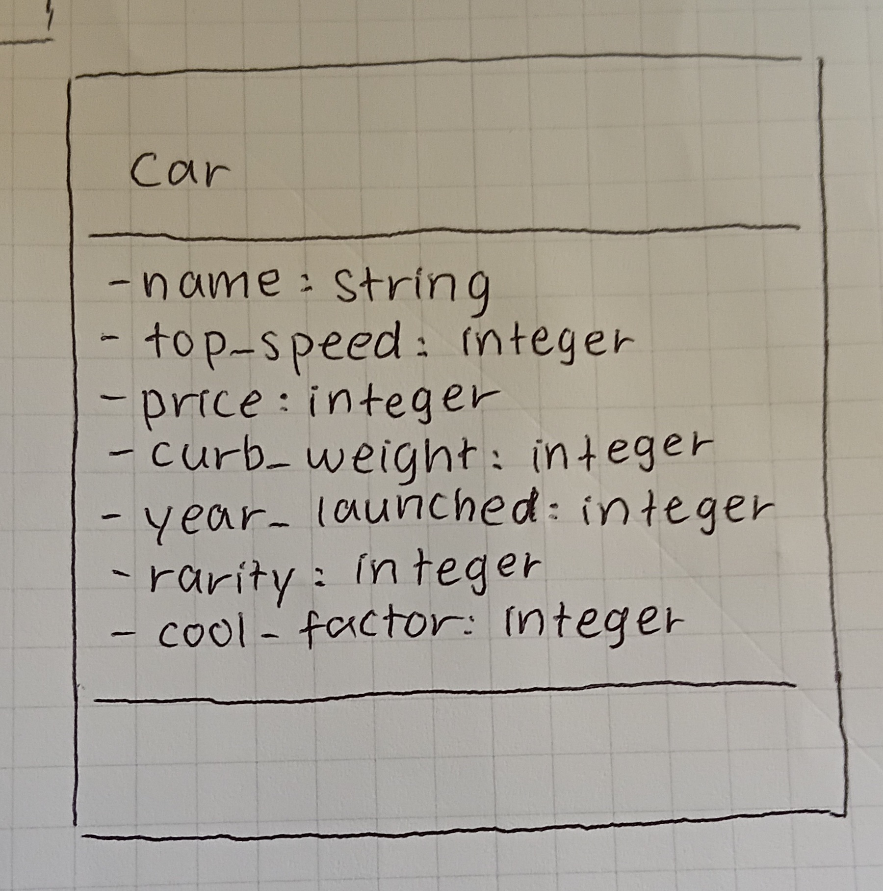

### Card
Represents a playable card on the board, where each contains a car object. This class manages how a card can move into a new position, or when it can be flipped.

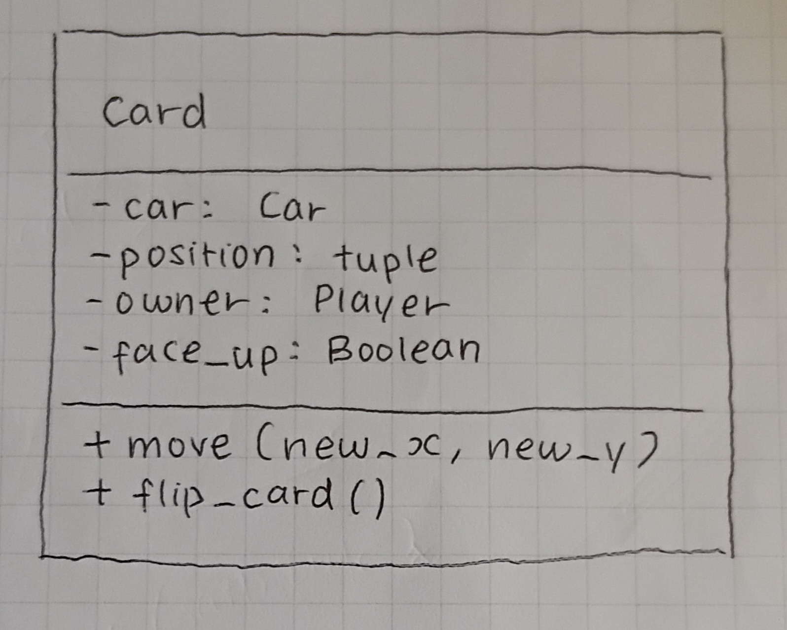

### Deck
The deck stores all the cards used in the game and distributes them to players at the beginning of a game.

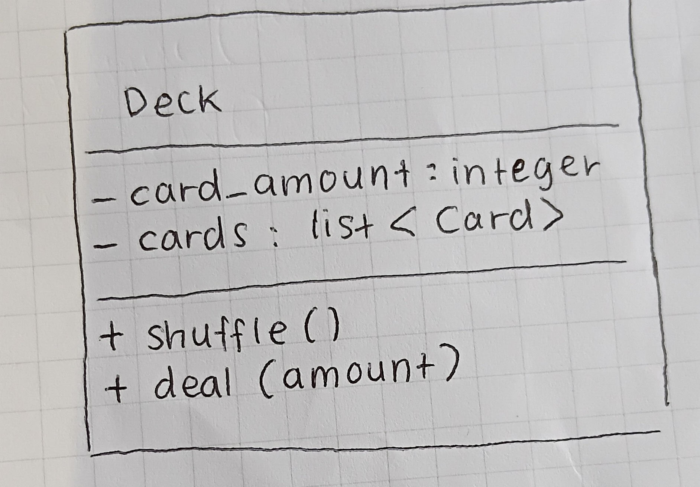

### Player
This class represents a player and manages the cards they own and place on the board.

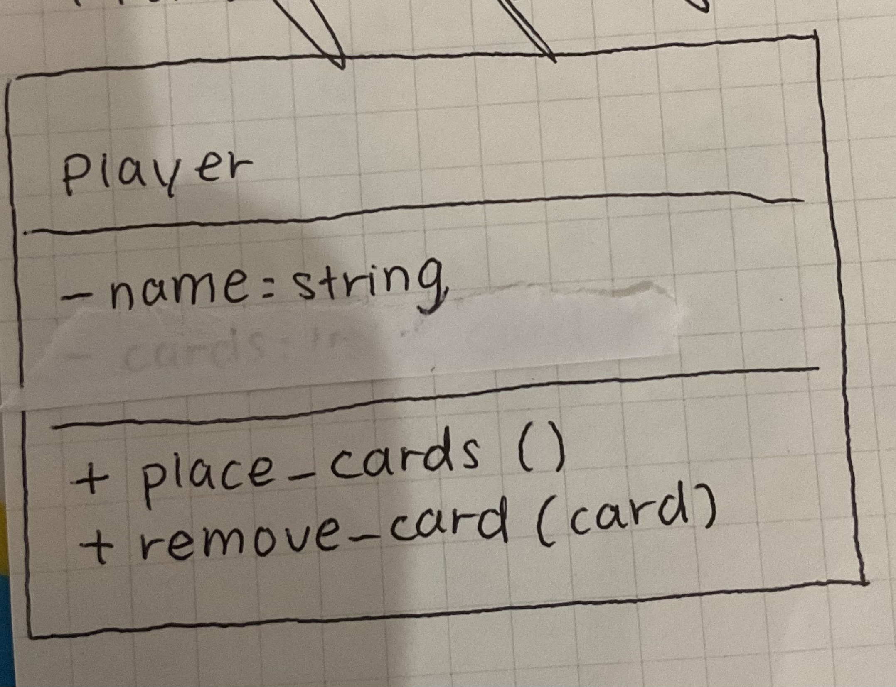

### Hand
The hand class represents the player's hand, essentially the card that the player owns. It manages checking how many cards each player has, and who owns which hand.

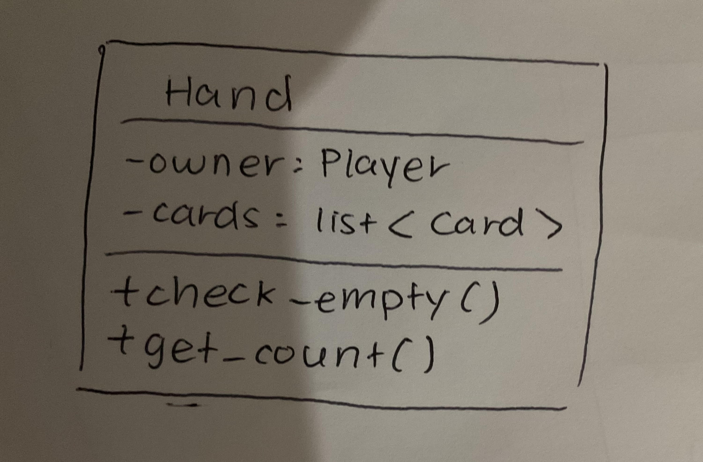

### Game 
The game class manages the deck, players, cards and board by controlling the overall game flow, turn order, battle states and winning conditions.

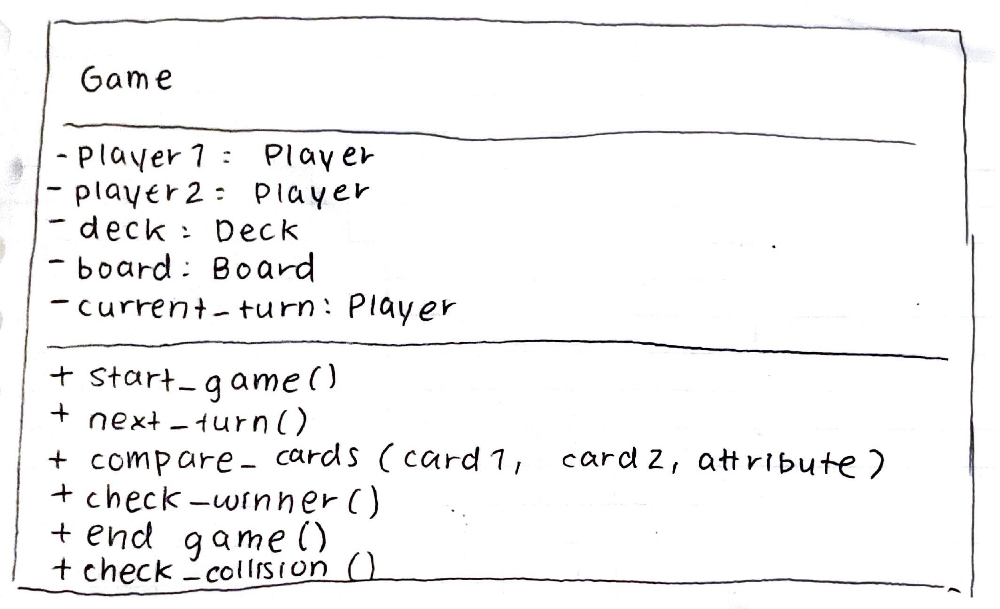

### Board
The board class stores and manages the attribute squares that make up the board, and can rearrange them for every new game.

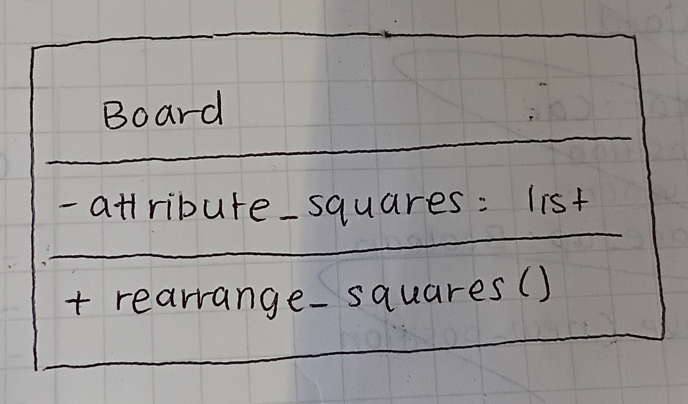

## Part C - Class Diagram
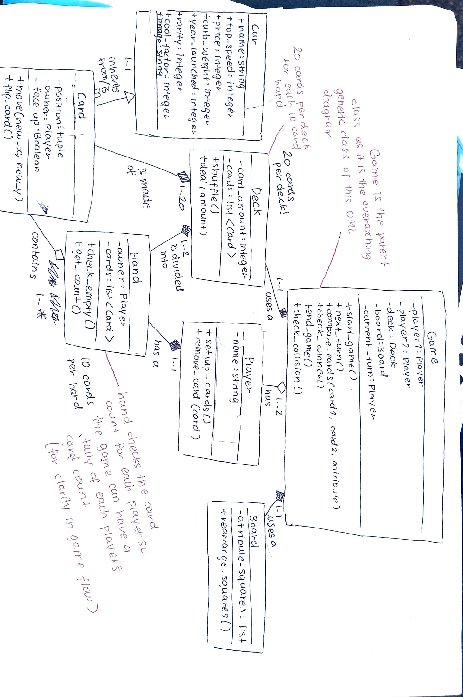

## Part D - Game Mechanics Design
My car comparison game is, in summary, a Stratego-esque Top Trumps board game. It is a two player game that is played on a 6 x 6 grid, where on each square is an attribute corresponding to the car cards (eg. top speed, cool factor). The game begins with both players being handed 10 cards each, which they should line on the outer squares of the 6x6 grid on their side of the grid. Cards should be oriented facing down towards your opponent as to not confuse player cards. 

Each round, each player is allowed to move one card orthogonically or diagonally by 1 square, with the knowledge that they cannot have 2 of their own cards on the same square. If two cards (both players' cards) occupy the same square, both players must flip their card over and compare the stats of the attribute written on the matched square. The player who wins the round will depend on the attribute:

- **price:** highest wins
- **year launched:** newest wins 
- **top speed:** highest wins
- **total produced / rarity:** lowest wins
- **curb weight:** highest wins
- **cool factor:** highest wins

The losing card is removed from the board, while the winning card remains, flipped face down again. In the instance that both players have equal stats, both cards must be removed from the board. The player who remains with cards on the board wins, and the game ends. If both players end up with matching stats on their last cards, the game concludes in a draw.

### How is this game fair?
The game balance is ensured by the random nature of each square's attribute and the attributes of the card you receive. Unlike a typical Top Trumps game, players don't get to have the advantage of choosing attributes to compare, which not only helps create anticipation/tension when flipping the cards, but also contributes to minimising any imbalances caused by this. Additionally, the board is 6 by 6 to ensure that there is an equal amount of squares for each attribute to prevent any advantages for specific attributes.  

However, one possible unfair advantage that may occur in this game is the fact that some specific types of cars, like large heavy duty vans are quite disadvantaged as none of the attributes are specifically favourable, while light luxury cars are quite advantageous cards. On the other hand, I feel having specific cars that are more advantageous as others is important for creating variation in gameplay, however a solution that could help make the game a little more fair is to rule out vans as they are not technically "cars", and to decrease the amount of these advantageous car cards in a deck to make sure any advantageous cards help make the game interesting while not greatly impacting the actual game's results.

### Structure Chart 
- insert structure chart

## Part E - Interface and Card Design
### Basic Card Design (Top Trumps Style)
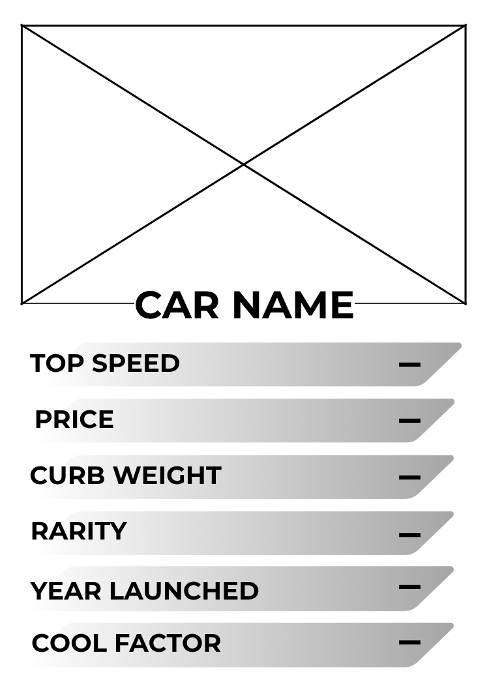
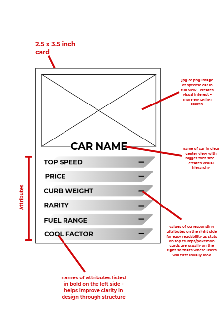

**Will probably look like the following card image in terms of style (discluding the Top Trumps File text blob):**
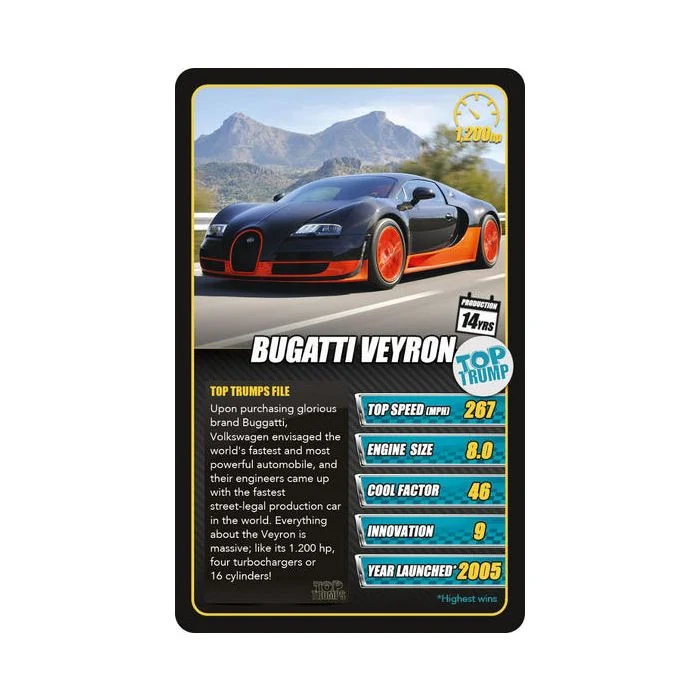
**My design will have different colours for the attributes, so instead of just blue, each attribute will be allocated a colour that corresponds to the board.**

### Basic Game Interface Sketch
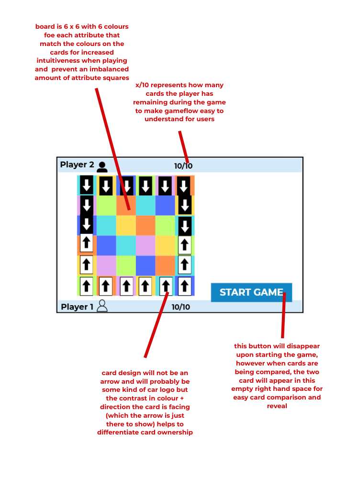

### Storyboard
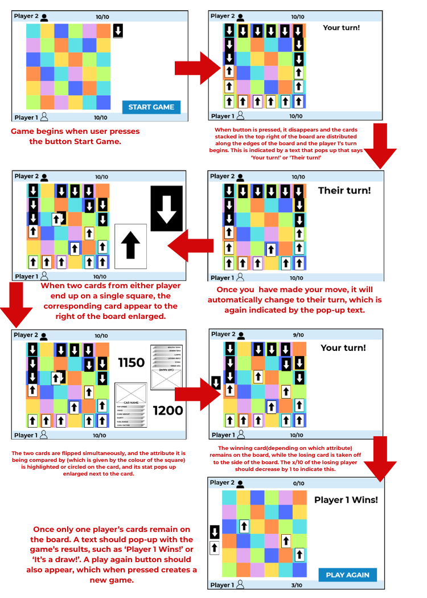

## Part F - Social, Ethical and Legal Implications
### 1. Individual Impact
**How could your game influence user behaviour or decision-making?**
- might create biases in what cars they thinka re good depending on how they perform in the game

**Could it encourage bias (eg. favouring expensive or high-performance cars)?**
- slightly yes, maybe toward () but i tried to limit this

**What responsibilities do you have as a designer to present fair information?**
- make sure theres equal chances of winning for all ranges of cars
- make sure information is from verified sources

---
### 2. Social Impact
**How might your game reinforce stereotypes or inequalties(eg. wealth, status, access to vehicles)?**

**Does your system favour certain types of users or cars?**

**How could your design be made more inclusive or fair?**

---
### 3. Environmental Impact
**How could your game influence attitudes toward fuel use, emissions, or sustainability?**

**Does your attribute selection promote or ignore environmental considerations?**

My attribute selection does omit environmental considerations by purely comparing cars off superficial or performance-based statistics such as top speed and cool factor.

**What changes would you make to encourage more environmentally responsible thinking?**
 Next time, I would consider putting an attribute like fuel type, where electric cars would get a higher advantage as to raise more awareness on the negative environmental impacts of diesel and petrol cars and encourage players to think more responsibly when buying a car.

---
### 4. Legal Considerations
**What legal issues could arise from using real-world car data (eg. ownership, copyright, accuracy)?**

**What responsibilities do you have when displaying or using data inspired by platforms like carsales.com.au?**

**How would you ensure your system avoids misleading users?**